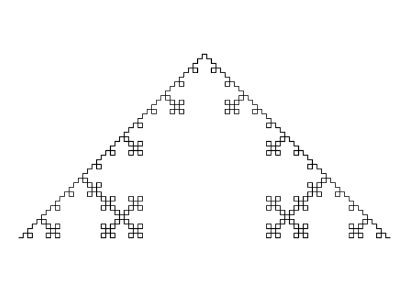

<!-- README.md is generated from README.Rmd. Please edit that file -->

# lsystem

<!-- badges: start -->
<!-- badges: end -->

The goal of lsystem is to …

## Installation

You can install the development version of lsystem from
[GitHub](https://github.com/) with:

``` r
# install.packages("devtools")
devtools::install_github("t-arae/lsystem")
```

## Example

``` r
library(lsystem)

## Plot Koch curve with L-system
lsystem2("F", c("F" = "F+F-F-F+F"), 4) |>
  w2curve() |>
  plot_curve()
```


